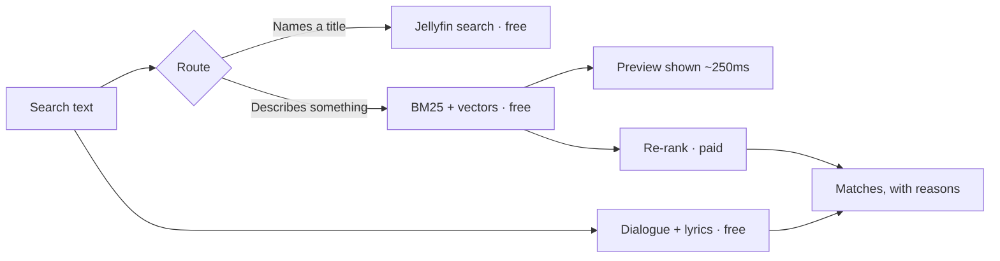

# Concierge

A Jellyfin plugin that finds things in your library from a description rather
than a title.

> that film where he tattoos the clues on himself

> something dark and twisted from the nineties

> "I'm walking here"

Jellyfin's own search is untouched and still instant. Concierge adds a **Matches**
row above it for the queries substring search cannot answer: a half-remembered
plot, a mood, a decade, a line of dialogue.

---

## What it actually does

At index time it asks a model what each item is *about* — the premise, the
moments people remember, the themes, and a set of phrasings somebody who has
forgotten the title might use. Those phrasings are the heavy lifter: each is
embedded on its own, so a vague sentence is compared against other vague
sentences rather than against marketing copy.

At search time it routes. A query that names something in your library goes to
Jellyfin and costs nothing. A description goes through keyword and semantic
retrieval, then a model puts the shortlist in order and says why each one
matched.

It also reads the subtitles already inside your files, so a remembered line finds
the scene and the timestamp.



**Concierge never edits your library.** Everything it generates is a cache under
`data/concierge/`, and deleting it restores exactly the behaviour you had before
installing.

---

## Install

Targets Jellyfin **10.11.11**, .NET 9.

1. **Dashboard → Plugins → Repositories → Add**

   ```text
   https://raw.githubusercontent.com/nitramivel/jellyfin-concierge/main/manifest.json
   ```

2. Install **Concierge** from the catalogue and restart.
3. Open **Dashboard → Plugins → Concierge**.
4. On the **Models** tab, add a chat profile and an embedding profile, then press
   **Use this one**. Save.
5. On the **Index** tab, build the index — or wait for the nightly task.

Providers: OpenAI, Anthropic, Google and any OpenAI-compatible endpoint (Ollama,
LM Studio, vLLM, OpenRouter) for chat; OpenAI, Google, Voyage and compatible
endpoints for embeddings. A local embedding server makes the index free.

---

## Using it

**In the search box.** Type. Native results appear instantly; the **Matches** row
appears above them. The ✦ icon in the search field turns Concierge off — no row,
no request, nothing spent.

**Quote a line** in quotation marks and a **Said in…** row appears with
timestamps.

**The Library tab** shows everything Concierge holds for every item: the premise,
themes, moments and phrasings; the exact text embedded for each vector row; a
sample of extracted dialogue; and which build wrote it, on which model, at what
cost. Shows expand to their episodes, and episodes expand to the same detail.

The number to watch there is **items with nothing to search on** — an item with no
phrasings is findable by title and overview alone, which is the search this
plugin exists to beat.

---

## Which model runs which pass

Concierge is four jobs, and they want different models. The **Models** tab is a
table, one row each:

| Pass | When it runs | What to put there |
|---|---|---|
| **Plan** | Only on queries carrying a constraint | Anything cheap |
| **Re-rank** | Every paid search — **~99% of the wait** | Judge on speed as much as taste |
| **Enrichment** | Index build only, once per item, ever | The best you can afford |
| **Episodes** | Same, on episodes | Something cheap — see below |
| **Embeddings** | Everything. **Changing it invalidates the index** | Local is free |

**Thinking is set per pass too**, and the trade is opposite at the two ends.
Reasoning tokens are billed as output and generated before the answer, so on a
search they are pure delay; on enrichment nobody is waiting and the result is
permanent. Leave it off for re-rank, consider it on for enrichment.

---

## What it costs

Measured on a 264-item library, `gpt-5.6-luna` and `text-embedding-3-small`:

| | |
|---|---|
| Full index build | **$0.09**, about ten minutes |
| Incremental rebuild | free when nothing changed |
| Paid search | **$0.0014** average |
| Free search (title, cached, or Concierge off) | **$0** |

Some things worth knowing before they surprise you:

**Latency is one number.** A re-rank call's duration tracks the tokens it writes
at **0.94 correlation**, at a flat ~166 tokens a second. Pipeline overhead outside
model calls is **11 ms**. If a search feels slow it is the model writing — so the
dials that matter are *longest match reason* and *results that get a reason*.

**Nothing waits on that anyway.** The free keyword answer returns in about a
millisecond and is painted at ~250 ms; the ranked order replaces it when it
arrives, and the cards slide into their new positions.

**Episodes are a different economy.** Turning them on took one library from 272
items to 5,270, and **45% of episodes came back unknown to the model** — it has
never heard of *"Sow, Do You Like Them Apples"*. Give them their own cheap
profile, or leave them off.

**The model you pick is the whole bill.** The same rebuild was $0.17 on a
$0.20/$1.20-per-million model and would have been **$3.60** on a $5/$25 one. The
run log breaks every build down by model *with the rates it was billed at*, so
that is answerable rather than mysterious.

Budgets are separate for queries and enrichment, there are per-user rate limits,
and every paid path degrades to the free one rather than erroring.

---

## Privacy

Library metadata — titles, overviews, genres, cast — goes to the enrichment
provider at index time. Search text and shortlisted item descriptions go to the
query-time provider. Subtitles are read locally and never sent anywhere.

`LogQueryText` keeps every cost and routing figure while dropping the words, if
you would rather not keep a two-year record of what everyone in the house
searched for.

**API keys are stored in Jellyfin's plugin configuration in plain text**, as with
every Jellyfin plugin.

---

## Status

Version `0.x`, deliberately. Everything described here is built and running, but
**search quality is not yet measured**: `eval/queries.md` holds 40 real queries
with no expected answers filled in, so every claim about *quality* on this page is
designed-for rather than demonstrated. Claims about *cost and latency* are
measured, and say so.

That evaluation, and a ranked answer inside `PLAN.md`'s 2.5-second budget, are the
1.0 gate.

See [eval/README.md](eval/README.md) for the measurement workflow and
[PLAN.md](PLAN.md) for the architecture, the hard rules, and why each decision
went the way it did.

---

## Development

No runtime dependency beyond Jellyfin's controller and model assemblies. Tests
never call a live provider.

```bash
dotnet test Jellyfin.Plugin.Concierge.sln -c Release
git diff --check
```

Build and release steps are in [CLAUDE.md](CLAUDE.md), including the rule that
keeps `manifest.json` short and the one that says never to rewrite a published
entry's checksum.

---

## Scope

Concierge turns a sentence into the right items. It is not a rules engine — use
[SmartLists](https://github.com/jyourstone/jellyfin-smartlists-plugin) — and not a
recommender; [Curator](https://github.com/nitramivel/jellyfin-curator) is the
sibling project for that.
