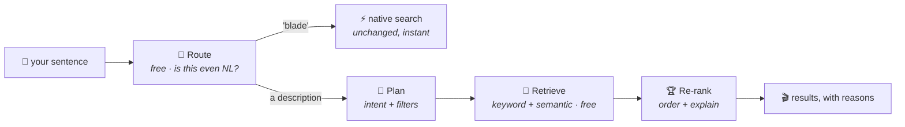

<div align="center">

# 🔎 Concierge

**A Jellyfin plugin that lets you search your library<br/>the way you'd describe a film to a friend.**

[](https://jellyfin.org)
[](https://dotnet.microsoft.com)
[](#-status)

*"that 90s movie where the guy can't make new memories" · "something funny but not stupid"<br/>"90s sci-fi under two hours I haven't seen" · "I'm walking here!"*

</div>

---

Jellyfin's search is a substring match. Type `blade` and you get Blade Runner —
which is exactly right, and exactly all it does. Type *"the one where he tattoos
the clues on himself"* and you get nothing, because no title contains that
string.

Concierge adds the other half: a search that reads the sentence, understands
what you're describing, and finds it among the things you actually own.

## 🎯 Scope

Concierge does one thing: **turn a sentence into the right items in this
library.**

It is not a filter UI and not a rules engine — [SmartLists](https://github.com/jyourstone/jellyfin-smartlists-plugin)
already does that well. It is not a recommender — that's
[Curator](https://github.com/nitramivel/jellyfin-curator), its sibling plugin.
Concierge answers a question you asked. Curator answers one you didn't.

It never writes to your library. The index is a cache; delete it and you're
exactly where you started.

## 🧠 How it will work



**Route.** Most searches aren't natural language — they're four letters of a
title you already know. Those go straight to Jellyfin's own search, instantly
and for free. No model is called and nothing gets slower.

**Plan.** A description gets read once by a small model, which pulls out what
you actually asked for: the gist, and any real constraints hiding in the prose
(*"90s"*, *"under two hours"*, *"that I haven't seen"*).

**Retrieve.** Two searches run over a local index of your library — keyword
matching for names and titles, semantic matching for plot and tone — and their
results are merged. This step costs nothing and calls no model, which is what
makes Concierge keep working when the budget runs out.

**Re-rank.** The shortlist goes to a model, which puts it in order and says *why
each one matched*. That one line under the poster is the difference between a
semantic result you trust and one that just feels like a guess.

**Quotes** *(later)*: subtitles get indexed too, so *"I'm walking here!"* finds
the film **and the timestamp**, and playback starts five seconds before the line.

### The part that makes it actually work

Film overviews describe the *premise*; people remember *moments*. John Wick's
overview says "ex-hitman comes out of retirement to track down the gangsters that
took everything from him" — so *"the one where they kill the guy's dog"* finds
nothing, even with perfect semantic search.

So when Concierge builds its index it also asks a model, once per film, *"how
would someone who half-remembers this describe it?"* — and indexes those
phrasings too. Your fuzzy sentence then gets matched against **other fuzzy
sentences about the same film** instead of against marketing copy. That's the
difference between a demo and something you'd actually use.

## 💸 What it costs

**~1.4¢ per natural-language search** (a small model reads the sentence, a
mid-sized one ranks the results) — and most searches never reach a model at all,
because anything that looks like a title goes straight to Jellyfin's own search
for free. Figure **$4–7/month** for a household.

Building the index costs **a couple of dollars, once.**

There's a monthly cap, and when you hit it Concierge quietly falls back to the
free keyword+semantic path instead of breaking. Embeddings can run locally
against Ollama or LM Studio, in which case the index costs nothing and no library
data leaves the house.

## 📊 Status

**Phases 0 and 1 are written — it searches, and nobody has run it yet.** In the
repo: the plugin and its provider stacks, the index (documents, enrichment,
BM25, embeddings, fusion), the router, the daily index task, and
`POST /Concierge/Search`. 114 tests, no network.

**Not yet installed on a live server, and no index has ever been built**, so
there are no quality numbers — [`eval/results-phase1.md`](eval/results-phase1.md)
says exactly what was and wasn't measured. Treat the search quality here as
designed-for, not demonstrated.

[`PLAN.md`](PLAN.md) is the full execution plan: architecture, phases, fourteen
hard rules, the cost model, and the open questions that could still change the
design. It's grounded rather than speculative — the subtitle coverage, API
surface, and cost figures in it were measured against a real library and the
real 10.11.11 assemblies, and where something couldn't be verified it says so.

Concierge is the second plugin in a pair; [Curator](https://github.com/nitramivel/jellyfin-curator)
is running against a live 10.11.11 server, and its provider stack, release
process, and hard-won Jellyfin lessons are the foundation this one is built on.

**Prior art:** [jellyfin-plugin-ai-search](https://github.com/Franciskid/jellyfin-plugin-ai-search)
already does a good chunk of this and is worth your attention if you want
something installable today. `PLAN.md` §1.1 covers what Concierge takes from it
and where the two genuinely differ — chiefly the enrichment step above, hybrid
keyword+semantic retrieval, and dialogue search.

## 🗺️ Roadmap

| Phase | What lands |
|---|---|
| **0** ✅ | Plugin skeleton, model profiles, config page |
| **1** ✅ | The index + free keyword/semantic search, via API |
| **2** | Natural language: intent parsing, re-ranking, explanations, web UI |
| **3** | 🗣️ Quote search with timestamps |
| **4** | Health checks, personalization, "more like this" |

## 📦 Installation

Not yet installable. When it is, it'll be the usual: add

```
https://raw.githubusercontent.com/nitramivel/jellyfin-concierge/main/manifest.json
```

as a plugin repository in Jellyfin, install Concierge, and set a model profile.
