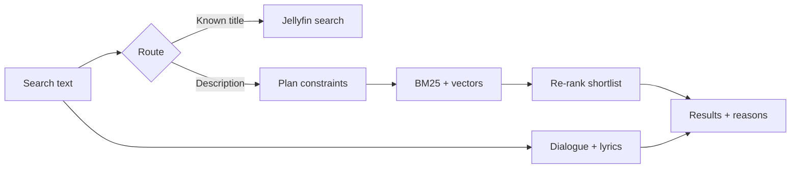

# Concierge

Concierge is a Jellyfin plugin for searching a library the way you would
describe something to a friend:

> that film where he tattoos the clues on himself

> something funny but not stupid for a Sunday

> I'm walking here

Jellyfin's native search remains intact. Title-like queries still use it;
descriptive queries gain local keyword and semantic retrieval, optional model
planning and re-ranking, short match explanations, and dialogue or lyric hits
with timestamps.

## What it does

- Adds Concierge results to Jellyfin Web without replacing native results.
- Routes obvious title searches to Jellyfin's fast, free search path.
- Retrieves from a local hybrid index using BM25 and embeddings.
- Enriches library metadata with descriptions of memorable plots, moments,
  themes, and moods.
- Optionally reads constraints such as decade, runtime, genre, and watch state.
- Re-ranks a shortlist and explains why each result matched.
- Indexes dialogue and lyrics for remembered-line searches with timestamps.
- Shows a free preview immediately while a paid ranking request is still running.
- Tracks usage, costs, index-build progress, and degradation from configured
  budgets or unavailable providers.

Concierge never edits library items. Its generated data is a disposable cache.

## How search works



The retrieval step is local and free after the index exists. Model calls are
limited to three named places: index-time enrichment, query planning, and
re-ranking. If a provider fails or a budget is exhausted, search degrades to the
free path rather than returning an error.

## Installation

Concierge targets Jellyfin `10.11.11` and .NET 9.

1. In Jellyfin, open **Dashboard → Plugins → Repositories**.
2. Add this repository URL:

   ```text
   https://raw.githubusercontent.com/nitramivel/jellyfin-concierge/main/manifest.json
   ```

3. Install **Concierge** from the catalogue and restart Jellyfin when prompted.
4. Open **Dashboard → Plugins → Concierge**.
5. Configure at least one embedding profile. Configure a chat profile if you
   want enrichment, planning, or re-ranking.
6. Save, then build the search index from the Index tab or Jellyfin's Scheduled
   Tasks page.

The configuration page can assign a different model to each pass. OpenAI,
Anthropic, Google, and OpenAI-compatible chat endpoints are supported; embedding
profiles support Google, Voyage, and OpenAI-compatible endpoints such as Ollama,
LM Studio, or vLLM.

## Index lifecycle

The scheduled index task is incremental. Unchanged enrichment and vectors are
reused, so routine refreshes generally cost nothing.

The Index tab also offers **Regenerate index**. This deliberately ignores every
cached enrichment and vector and recreates them from source metadata. It is
useful after changing enrichment strategy or when diagnosing a bad index, but it
can cost as much as the initial build. The current index remains searchable
until the replacement is successfully written.

Episode enrichment is disabled by default for a reason: it can multiply a
modest film-and-series index into thousands of model calls, while models often
know little about individual episodes.

## Cost and privacy

Costs depend on provider, model, library size, and query volume. Concierge has
separate monthly and enrichment budgets, per-user rate limits, and pass-level
switches. Local embeddings can make index vectors free and keep that text on the
server.

Library metadata is sent to the configured enrichment provider. Search text and
shortlisted item descriptions are sent to configured query-time providers.
Query logs can retain cost and routing data without retaining the search text.
API keys are stored in Jellyfin's plugin configuration as plain text.

## Project status

The plugin is installable and has been exercised on Jellyfin `10.11.11` against
a real library. The web integration, hybrid retrieval, model passes, quote and
lyric search, budgets, run logs, and index administration are implemented.

Search quality is not yet a published benchmark. The real-library evaluation
set still needs expected answers before recall and ranking claims can be made.
See [eval/README.md](eval/README.md) for the measurement workflow and
[PLAN.md](PLAN.md) for the architecture, invariants, and design history.

## Development

The repository has no runtime dependency beyond Jellyfin's controller and model
assemblies. Tests never call live model or embedding providers.

```bash
/home/levi/.dotnet/dotnet test Jellyfin.Plugin.Concierge.sln -c Release --no-restore
git diff --check
```

Build and packaging details are in [CLAUDE.md](CLAUDE.md).

## Scope

Concierge turns a sentence into the right library items. It is not a rules
engine or filter builder; use
[SmartLists](https://github.com/jyourstone/jellyfin-smartlists-plugin) for that.
It is not a recommender; [Curator](https://github.com/nitramivel/jellyfin-curator)
is the sibling project for recommendations.
